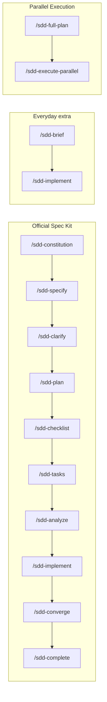
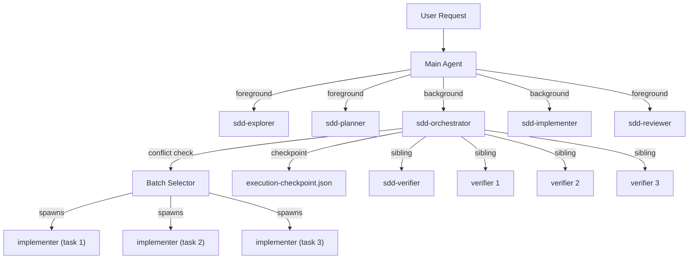

# SDD Cursor Commands — Technical Documentation

<div align="center">

[](https://cursor.com)
[](https://cursor.com/changelog/06-18-26)

**Full reference for SDD v6.1.** For a quick start, see the [README](../../README.md).

[What's New](#whats-new-in-v61) • [Commands](#commands) • [Memory](#memory) • [Subagents & Skills](#subagents--skills) • [Workflows](#workflows) • [Architecture](#architecture) • [Project Structure](#project-structure)

</div>

---

## What's New in v6.1

- **Official Spec Kit command flow** — Port of GitHub Spec Kit `templates/commands/*.md` (fetched 2026-09-02) as `/sdd-*`. Sequence: constitution → specify → clarify → plan → checklist → tasks → analyze → implement → converge → complete.
- **Breaking rename** — Every plugin command is `/sdd-*`. Unprefixed `/specify`, `/implement`, `/tasks`, `/brief`, … are gone. Native Cursor tools stay unprefixed (`/goal`, `/review`, `/autopilot`).
- **Official artifacts** — `/sdd-plan` writes Phase 0 `research.md` plus Phase 1 `data-model.md`, `contracts/`, `quickstart.md`. `/sdd-tasks` uses `T001 [P] [US1]` + file paths. Constitution lives at `.sdd/memory/constitution.md`.
- **Cursor packaging kept** — AskQuestion (not markdown wait-loops), `/goal` + sibling `sdd-verifier` on `/sdd-implement`, `FEATURE_DIR` = `specs/active/[task-id]/`. No specify-cli, no `.specify/`.

### Still in from v6.0

- **Cursor 3.8 throughout** — Aligned to the latest runtime (was 3.2). New badges, docs, and command guidance.
- **Pluggable Memory** — Optional long-term memory with three backends: `standard` (rules-only, default), `cursor-native` (Cursor 3.8 Memories), and `mem0` (free self-host). Configure with `/sdd-memory`; agents recall before planning and persist durable facts after. See [Memory](#memory).
- **Native Review integration** — `sdd-reviewer` and `/sdd-audit` now lean on `/review` (Bugbot + Security Review) for mechanical checks and own the spec-compliance verdict.
- **Cloud Subagents** — `/sdd-execute-parallel` and `sdd-orchestrator` can offload long-running, risky, or environment-heavy tasks via `/in-cloud`, and prep PRs with `/autopilot`. Ships `.cursor/environment.json` for fast cloud startup.
- **Optional plugin hooks** — Fail-open `subagentStop` / `stop` in plugin `hooks/` (structured notes only). Not copied to `.cursor/hooks.json`.
- **Two-level nest + fan-out** — Sibling verifiers; `/sdd-research` and `/sdd-implement` spawn multiple Tasks in one message. `/sdd-implement` uses `/goal` when available.
- **Custom Modes** — Pin `sdd-implementation` (and planning/sdd-audit/sdd-research) with Option+Enter / Alt+Enter.
- **Deep Research** — Multi-pass external investigation with web search, documentation deep-dives, and confidence scoring (`/sdd-research --deep`).
- **File Conflict Detection** — Tasks declare `touchedFiles` so the orchestrator prevents parallel edits to the same files.
- **Progressive Context Loading** — Heavy roadmaps (40+ tasks) load only the current batch.
- **Checkpoints & Resume** — `execution-checkpoint.json` enables `/sdd-execute-parallel --resume`.
- **Downstream Propagation** — `/sdd-evolve` marks stale downstream docs when a spec changes.
- **Sandbox Controls** — Granular network access via `.cursor/sandbox.json`.
- **Plugin Packaging** — Distributable as a Cursor Marketplace plugin (`.cursor-plugin/`).

---

## Commands

### Planning

| Command | Purpose | Output |
|---------|---------|--------|
| `/sdd-init` | Scaffold `.sdd/` + `specs/` + constitution stub | `.sdd/config.json` |
| `/sdd-constitution` | Project principles (official) | `.sdd/memory/constitution.md` |
| `/sdd-specify` | WHAT/WHY spec + quality checklist | `spec.md` + `checklists/requirements.md` |
| `/sdd-clarify` | Up to 5 targeted AskQuestion clarifications | `spec.md` Clarifications |
| `/sdd-plan` | Architecture + Phase 0/1 artifacts | `plan.md`, `research.md`, `data-model.md`, `contracts/`, `quickstart.md` |
| `/sdd-checklist` | Extra reviewer-owned quality lists | `checklists/[slug].md` |
| `/sdd-tasks` | Official `T001 [P] [US1]` + 1:1 checklist | `tasks.md` + `todo-list.md` |
| `/sdd-analyze` | Read-only consistency (passes A–F) | chat report |
| `/sdd-brief` | 30-min quick planning (everyday extra) | `feature-brief.md` |
| `/sdd-research` | Pre-spec pattern investigation (`--deep`) | `research.md` |
| `/sdd-generate-prd` | PRD via Socratic questions | `full-prd.md` |
| `/sdd-full-plan` | Complete project roadmap | `roadmap.json` + tasks |

### Execution

| Command | Purpose |
|---------|---------|
| `/sdd-implement` | Finish remaining `T0xx` (`[X]`); `/goal` + sibling verifier |
| `/sdd-converge` | Append-only gap tasks or report converged |
| `/sdd-complete` | Archive spec (warn if last converge was not clean) |
| `/sdd-execute-task` | Run single task from roadmap (`--until-finish` supported) |
| `/sdd-execute-parallel` | Parallel DAG execution via async subagents (`--resume`, `--dry-run`) |

### Maintenance

| Command | Purpose |
|---------|---------|
| `/sdd-evolve` | Update specs with discoveries + downstream propagation |
| `/sdd-refine` | Iterate on specs through discussion |
| `/sdd-upgrade` | Brief → Full SDD planning |
| `/sdd-audit` | Compare implementation against specs (folds in native `/review`) |
| `/sdd-generate-rules` | Auto-generate coding rules |
| `/sdd-memory` | Configure the memory backend (standard / cursor-native / mem0) |

### Native Cursor 3.8 tools SDD plugs into

| Tool | How SDD uses it |
|------|-----------------|
| `/review`, `/review-bugbot`, `/review-security` | `sdd-reviewer` + `/sdd-audit` run these for fast Bugbot/Security checks, then add spec compliance |
| `/in-cloud` | User alias; orchestrator prefers Task `environment: "cloud"` |
| `/autopilot` | Hand a finished task's PR to a cloud agent to reach merge-ready |
| `/goal` | Long-lived `/sdd-implement` objective until the whole todo-list is closed |
| `/multitask` | Quick ad hoc parallel prompts with no SDD roadmap state |
| Memories | The `cursor-native` memory provider stores durable facts as Cursor Memories |

---

## Memory

SDD ships an **optional, pluggable memory layer** so agents can recall prior decisions, conventions, and gotchas across sessions — or stay completely stateless. The active backend lives in `.sdd/config.json` → `memory` and is managed with `/sdd-memory`.

| Provider | Setup | Cost | Best for |
|----------|-------|------|----------|
| `standard` *(default)* | None | Free | Solo work, max portability, or Privacy Mode users. Relies only on `.cursor/rules/` + `specs/`. |
| `cursor-native` | Toggle on | Free (Free/Pro/Team) | Anyone on Cursor 3.8 — durable facts captured as Cursor Memories, editable/deletable in the UI. |
| `mem0` | mem0 MCP / local API | Free (self-host) | Semantic, cross-session/cross-project recall you fully control (works even in Privacy Mode if self-hosted). |

**About `cursor-native`:** Cursor Memories is available on **all plans (Free, Pro, Team)** at the individual, per-project level — it is **not** a Team-plan feature. Enable it at **Settings → Rules → "Generate Memories."** It does require **Privacy Mode off** (it needs server-side state); if you run Privacy/Ghost mode, use `standard` or a self-hosted `mem0` instead.

**How it works:** the `sdd-memory` skill **recalls** relevant memories before planning/sdd-implementation and **persists** durable discoveries afterward. It never stores secrets, tokens, or file dumps. When the provider is `standard`, it is a no-op — the toolkit stays dependency-free.

```
/sdd-memory                  # interactive picker + status
/sdd-memory use cursor-native
/sdd-memory use mem0
/sdd-memory off              # back to standard
```

Adding another free/local backend is just a new entry under `memory.providers` plus a recipe in `skills/sdd-memory/references/providers.md` — no agent changes required.

---

## Subagents & Skills

### Subagents (plugin `agents/`)

Specialized agents with isolated context. Background agents run asynchronously — the parent continues working.

| Subagent | Model | Mode | Purpose |
|----------|-------|------|---------|
| `sdd-explorer` | inherit | foreground, readonly | Codebase discovery |
| `sdd-planner` | inherit | foreground | Architecture design |
| `sdd-implementer` | inherit | **background** | Code generation |
| `sdd-verifier` | inherit | foreground | Post-implementation completeness check |
| `sdd-reviewer` | inherit | foreground, readonly | Pre-merge quality review |
| `sdd-orchestrator` | inherit | **background** | Parallel task coordination with DAG |

**Reviewer vs Verifier:** The reviewer is a pre-merge quality gate (security, performance, style). The verifier is a post-implementation completeness check (does the code match the spec?). Verifier answers "is it done?", Reviewer answers "is it good?"

#### Subagent Tree

Two-level nest only. Parent spawns implementers, then **sibling** verifiers:

```
sdd-orchestrator (depth 1)
├── sdd-implementer (task 1)
├── sdd-implementer (task 2)
├── sdd-verifier (task 1)
└── sdd-verifier (task 2)
```

### Skills (plugin `skills/`)

Auto-invoked domain knowledge packages with progressive loading:

| Skill | Auto-Invoke When | Key References |
|-------|------------------|----------------|
| `sdd-research` | Technical approach unclear | `patterns.md`, `deep-research-guide.md` |
| `sdd-planning` | Spec exists, need plan | `estimation-heuristics.md`, `diagram-templates.md` |
| `sdd-implementation` | Plan ready for execution | `patterns.md`, `progress.sh` |
| `sdd-audit` | Code review requested | `checklist.md`, `validate.sh` |
| `sdd-evolve` | Discoveries during development | `changelog-format.md`, `propagation-guide.md`, `check-staleness.sh` |
| `sdd-memory` | Start/finish of planning or implementation | `providers.md` |

Each skill folder contains:
```
sdd-[name]/
├── SKILL.md          # Core instructions
├── references/       # Loaded on demand
├── scripts/          # Executable helpers
└── assets/           # Templates
```

---

## Workflows



| Flow | Commands |
|------|----------|
| **Official** | `/sdd-constitution` → `/sdd-specify` → `/sdd-clarify` → `/sdd-plan` → `/sdd-checklist` → `/sdd-tasks` → `/sdd-analyze` → `/sdd-implement` → `/sdd-converge` → `/sdd-complete` |
| **Shorter** | `/sdd-specify` → `/sdd-plan` → `/sdd-tasks` → `/sdd-implement` → `/sdd-converge` |
| **Everyday** | `/sdd-init` (once) → `/sdd-brief` → `/sdd-implement` → `/sdd-converge` → `/sdd-complete` |
| **Pre-spec research** | `/sdd-research` (or `--deep`) then official from `/sdd-specify` |
| **Parallel** (project roadmap) | `/sdd-full-plan` → `/sdd-execute-parallel` |
| **Heavy App** (20+ tasks) | `/sdd-full-plan` (Option C: Phased for 40+) → `/sdd-execute-parallel --until-finish` |

Official GitHub Spec Kit names are `/speckit.*`. This plugin maps them 1:1 to `/sdd-*`. `FEATURE_DIR` is `specs/active/[task-id]/`. Constitution is `.sdd/memory/constitution.md`. Not ported: specify-cli, `.specify/`, numbered `specs/003-*`, `taskstoissues`.

### Heavy App Path

For new apps with 20+ tasks or enterprise complexity:
1. `/sdd-full-plan [project-id] [description]` — create roadmap with DAG
2. For 40+ tasks: choose **Option C: Phased Creation** to create epics incrementally
3. `/sdd-execute-parallel [project-id] --until-finish` — run all tasks with conflict detection
4. `/sdd-execute-parallel [project-id] --resume` — resume after interruption via checkpoint

### Deep Research

For high-stakes technical decisions (database engines, auth providers, cloud platforms):
```bash
/sdd-research auth-provider Compare Auth0 vs Clerk vs Supabase Auth --deep
```

Deep research performs 4 passes: landscape scan → documentation deep-dive → real-world validation → integration feasibility. Results include source URLs, reliability ratings, and a confidence assessment.

### Automated Execution
```bash
# Execute until complete
/sdd-execute-task epic-001 --until-finish

# Create and execute entire project
/sdd-full-plan my-project --until-finish
```

---

## Architecture



---

## Project Structure

```
.cursor-plugin/plugin.json
agents/ commands/ skills/ rules/
docs/agent-manual.md
sdd/                          # Bundled templates; /sdd-init copies into the app
environment.json sandbox.json worktrees.json
```

In an **app repo**, run `/sdd-init` to create `.sdd/` + `specs/`. Commands/agents/skills live in this plugin, not under the app's `.cursor/` folder.

---

## Cloud & Sandbox

### Cloud environment (`.cursor/environment.json`)

Captures how cloud agents (`/in-cloud`, `/autopilot`) set up their VM so they start fast. This toolkit is prompt/markdown-only, so the default install step is a no-op — point it at your project's real install/build commands when you adopt SDD in an app repo. See the [Cursor cloud docs](https://cursor.com/docs).

### Sandbox (`.cursor/sandbox.json`)

Granular network access controls for sandboxed commands. Defaults allow common package registries (npm, pypi, GitHub, Docker, Deno) while denying private networks. Customize by editing `.cursor/sandbox.json`.

---

## Templates

Available in `.sdd/templates/`:

| Template | Purpose |
|----------|---------|
| `feature-brief-v2.md` | Quick 30-min planning brief |
| `constitution-template.md` | Project principles stub → `.sdd/memory/constitution.md` |
| `spec-template.md` | Official-shaped feature specification |
| `plan-template.md` | Official plan (constitution check + Phase 0/1) |
| `tasks-template.md` | Official `T001 [P] [US1]` task list |
| `checklist-template.md` | Reviewer-owned quality checklist |
| `spec-compact.md` | Legacy compact spec (kept) |
| `plan-compact.md` | Legacy compact plan (kept) |
| `tasks-compact.md` | Legacy compact tasks (kept) |
| `research-compact.md` | Research findings |
| `todo-compact.md` | Implementation checklist |
| `audit-report.md` | Structured audit output |
| `changelog.md` | Spec evolution log |
| `progress-report.md` | Execution progress summary |
| `retrospective.md` | Post-mortem / lessons learned |
| `roadmap-template.json` | Kanban JSON structure |
| `roadmap-template.md` | Human-readable roadmap |
| `decision-matrix.md` | Brief vs Full SDD decision guide |

---

## Plugin Distribution

SDD is packaged as a Cursor Marketplace plugin. Add the git repo as a marketplace, then install `spec-kit-command-cursor`. First command in an app repo: `/sdd-init`.

---

## Contributing

- [Contributing guide](../../CONTRIBUTING.md) — How to add commands, subagents, skills, and templates
- [Report bugs](https://github.com/madebyaris/spec-kit-command-cursor/issues)
- [Suggest features](https://github.com/madebyaris/spec-kit-command-cursor/discussions)
