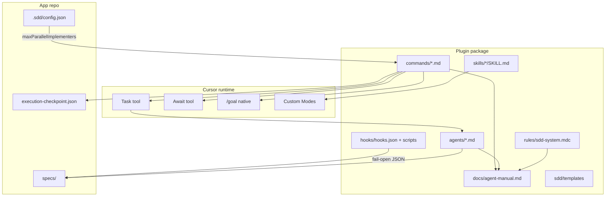

# Technical Plan: Cursor Runtime Alignment (2026)

**Task ID:** cursor-runtime-2026  
**Status:** Ready for Implementation  
**Based on:** spec.md, research.md

## Overview

This is a **protocol + packaging** change to a prompt/markdown Cursor plugin. No application runtime, no MCP, no compiled code except two small fail-open hook scripts.

**Single source of truth** for spawn/nest/cloud is `docs/agent-manual.md`. Commands, agents, and `rules/sdd-system.mdc` link to it and must not invent a second tree.

**Hard rules (locked):**

1. Nest depth ≤ 2. Implementer **never** spawns verifier. Parent (main or orchestrator) always spawns verifier as a **sibling**.
2. Fan-out = multiple `Task` calls in **one message**. Cap: `.sdd/config.json` `settings.maxParallelImplementers` (default 4). Same cap for explorers/planners.
3. Multi-planner/explorer children **return text**. Only the main agent writes `research.md` / `feature-brief.md` / `spec.md` / `plan.md`.
4. AskQuestion stays on main.
5. Hooks live in the **plugin** (`hooks/`). `/sdd-init` documents them; it does not copy them into `.cursor/hooks.json`.
6. `/babysit` → `/autopilot`. Cloud spawn prefers Task `environment: "cloud"`.

---

## 1. System Architecture



### Architecture decisions

| Decision | Choice | Rationale |
|----------|--------|-----------|
| Protocol home | Rewrite `docs/agent-manual.md` first; everything else copies | Stops the current three-tree contradiction |
| Verifier spawn | Always sibling; implementer never spawns | One rule. Legal at depth 1 *and* when orchestrator is depth 1 |
| Slice outputs | Children return markdown in the Task result; main writes the spec file | Avoid leftover `plan-slice-*.md` and write races |
| Hooks scope | Plugin `hooks/` (auto-discovered) | Activates with the plugin; no init overwrite of user `.cursor/hooks.json` |
| `/goal` | Prompt instruction in `/implement` (available-when-present) | Commands cannot invoke slash skills as tools |
| Parallel cap | Reuse `maxParallelImplementers` for all fan-out | Already in config; do not add a second knob this release |
| Isolated VM swarms | Out of scope | Spec; keep `touchedFiles` serialization |

---

## 2. Technology Stack

| Layer | Technology | Version | Rationale |
|-------|------------|---------|-----------|
| Plugin format | Cursor Plugin | `.cursor-plugin/plugin.json` | Already shipped; keep |
| Agent protocol | Markdown + YAML frontmatter | Cursor 3.8+ | `name`, `description`, `model`, `readonly`, `is_background` |
| Skills | Agent Skills | `icon`, `color` (Aug 2026) | Custom Modes |
| Commands | Markdown + YAML | `name`, `description` | `/` menu |
| Parallelism | Task + Await | Cursor 3.0+ | Official primitives |
| Long-run | `/goal` | Aug 2026 | Degrade if missing |
| Cloud | Task `environment: "cloud"` + `/in-cloud` + `/autopilot` | 3.7+ / current | Official names |
| Hooks | `hooks/hooks.json` + bash | Cursor hooks v1 | `subagentStop`, `stop` only |
| Config | `.sdd/config.json` | 6.0.x | Existing `maxParallelImplementers` |

**Dependencies:** none new (no npm/composer). Hook scripts are POSIX `sh` + `python3` or `jq` if present; must work with `sh` + stdin JSON only if python/jq missing (fail-open).

```json
{
  "runtime": "cursor-plugin",
  "newDependencies": []
}
```

---

## 3. Component Design

### C1 — Spawn protocol (`docs/agent-manual.md`)

- **Purpose:** Canonical nest, fan-out, Task fields, `/goal`, Custom Modes, native vs plugin commands.
- **Responsibilities:** Replace "any depth" and grandchild-verifier diagrams. Add Task table (`environment`, `cloud_base_branch`, `run_in_background`, `resume`, `bugbot`, `security-review`, `best-of-n-runner`). Label `/multitask`, `/review`, `/goal`, `/autopilot` as native.
- **Interfaces:** Linked from every command "See also" and from `sdd-system.mdc`.
- **Dependencies:** None.

### C2 — Agent prompts

| Agent | Change |
|-------|--------|
| `sdd-implementer` | Delete "spawn sdd-verifier". Report done + files + blockers. Parent verifies. |
| `sdd-orchestrator` | Sibling verifier after each implementer; Await; Task cloud params; `/autopilot`; checkpoint `agentIds`. |
| `sdd-explorer` | Tighten description: "SDD research report for /research /brief". May use built-in Explore internally. Do not write `research.md`. |
| `sdd-planner` | Do not write `plan.md`/`spec.md` when spawned as a child. Return a complete slice. No SwitchMode. |
| `sdd-verifier` | Unchanged role; parent invokes. |
| `sdd-reviewer` | `/babysit` → `/autopilot` if present. No bugbot Task this slice. |

### C3 — Command bodies (fan-out + honesty)

| Command | Body change |
|---------|-------------|
| `/research`, `/brief` | Split areas → up to N `sdd-explorer` Tasks in one message → main synthesizes file. AskQuestion on main before/after as today. |
| `/specify`, `/sdd-plan` | Split only when slices are obvious; else one planner or main. Main writes the file. |
| `/implement` | Instruct `/goal` (title + "until sibling verifier reports complete"). If ≥5 independent todos or user says parallel → implementer siblings → verifier siblings. Else one implementer or main, then sibling verifier. |
| `/execute-parallel` | Same sibling + Await protocol. Store agent IDs on checkpoint. |
| `/execute-task` | Align implement path with sibling verifier. |
| All 19 commands | YAML `name` + `description`. Headers match body. |

### C4 — Skills (Custom Modes)

Frontmatter only this slice:

| Skill | icon | color |
|-------|------|-------|
| `sdd-planning` | `book-open` | `blue` |
| `sdd-implementation` | `rocket` | `green` |
| `sdd-audit` | `shield` | `orange` |
| `sdd-research` | `beaker` | `purple` |

Document Option+Enter / Alt+Enter in agent-manual + README-technical. `sdd-evolve` / `sdd-memory` stay unbadged.

### C5 — Hook pack

```
plugins/spec-kit-command-cursor/hooks/
├── hooks.json
└── scripts/
    ├── subagent-stop.sh
    └── session-stop.sh
```

- Discoverable as plugin hooks (default `hooks/hooks.json`).
- **subagentStop:** parse stdin JSON; if `subagent_type` is `sdd-verifier` or prompt/task-id looks like a roadmap task, append a one-block note to `specs/active/*/progress.md` or `specs/todo-roadmap/*/execution-log.md` if those paths exist. Else exit 0.
- **stop:** if `execution-checkpoint.json` or `todo-list.md` exists, touch/rewrite timestamp or append "session ended". Never `/sdd-complete`.
- Exit 0 on any parse/path miss. Never exit 2.

`/sdd-init`: mention plugin hooks in the confirm blurb. Do **not** write `.cursor/hooks.json`.

### C6 — Hygiene sweep

- Replace `/babysit` in plugin runtime files (commands, agents, rules, docs, README, guidelines, ROADMAP_FORMAT_SPEC). Examples may keep a "formerly babysit" only in changelog template.
- `sddVersion: "6.0"` in roadmap template JSON/MD, `/sdd-full-plan`, ROADMAP_FORMAT_SPEC. Remove `planMode` or set `false` and drop PLAN Mode copy.
- `CallMcpTool` → `CallDynamicTool` in `skills/sdd-memory/references/providers.md`.
- Rewrite `sdd/guidelines.md` current-layout section (plugin folders, not `.cursor/commands/`).
- README + README-technical: Custom Modes, `/goal`, `/autopilot`, native command table.

---

## 4. Data Model

### Fan-out cap (existing)

```ts
// .sdd/config.json
settings.maxParallelImplementers: number; // default 4; also caps explorers/planners
```

### Execution checkpoint (extend)

```ts
interface ExecutionCheckpoint {
  projectId: string;
  lastCompletedBatch: string[];
  failedTaskId: string | null;
  nextReadyTasks: string[];
  timestamp: string;
  batchNumber: number;
  agentIds?: Record<string, { implementer?: string; verifier?: string }>;
}
```

`--resume` may pass `resume` to Task when an ID exists; if Cursor ignores it, still skip `done` tasks (today's behavior).

### Hook stdin (Cursor-defined; we consume a subset)

Treat as opaque JSON. Read common keys if present (`subagent_type`, `subagentType`, `prompt`, `agent_id`, `cwd` / `workspace_roots`). Never require a field.

### Goal text

```
Complete spec "<title>" in specs/active/<task-id>/ until the sibling sdd-verifier reports complete (or blockers are documented). Do not stop after a single pass.
```

---

## 5. API Contracts

There is no HTTP API. The contract is the **Task spawn protocol**.

| Caller | Tool | Params | When |
|--------|------|--------|------|
| Main `/research` | Task × N | `subagent_type: sdd-explorer`, slice prompt, no file write | Distinct areas |
| Main `/specify` `/sdd-plan` | Task × N | `subagent_type: sdd-planner`, slice prompt, "return text only" | Clean split |
| Main `/implement` | Task | `sdd-implementer`, `run_in_background: true` if long | Large or asked |
| Parent after implementer | Task | `sdd-verifier`, foreground | Always for that batch |
| Orchestrator | Task | implementers in one message; Await; then verifier siblings | Each DAG batch |
| Orchestrator (cloud) | Task | `environment: "cloud"`, optional `cloud_base_branch` | Long/risky/env-heavy |
| User | `/in-cloud`, `/autopilot`, `/goal` | Native | Aliases / session goal |

**Request example (one message, two explorers):**

```
Task: subagent_type=sdd-explorer
prompt: "Explore auth/session. Return SDD exploration summary. Do not write research.md."

Task: subagent_type=sdd-explorer
prompt: "Explore existing specs/ and memory-relevant conventions. Return summary. Do not write research.md."
```

**Response:** markdown summaries. Main merges into `research.md`.

---

## 6. Security Considerations

- Hooks fail-open; never `permission: deny` / exit 2.
- Hooks do not log prompts, transcripts, or secrets. Write only short status lines to existing SDD files.
- No new MCP; no plugin `variables` / tokens this slice.
- Cloud MCP ≠ local MCP — already true; do not tell cloud implementers to use mem0.
- `readonly: true` stays on explorer and reviewer.

**Checklist:** no secrets in hook output; no sandbox tighten; no force-copy over user hooks.

---

## 7. Performance Strategy

- Default max 4 parallel Tasks. Docs: N agents ≈ N× tokens.
- Do not fan out a single-area research or a 2-todo implement.
- Explorers stay readonly + may use built-in Explore (faster model) internally.
- Await instead of polling loops.
- Progressive loading for heavy roadmaps unchanged.

**Targets:** protocol correctness over speed. No latency SLO.

---

## 8. Implementation Phases

### Phase 0 — Setup (protocol lock)

- [ ] Rewrite `docs/agent-manual.md` (nest, fan-out, Task table, `/goal`, Custom Modes, native commands, `/autopilot`)
- [ ] Mirror the same nest/cloud lines in `rules/sdd-system.mdc` (short; link to manual)

### Phase 1 — Core (agents + commands that spawn)

- [ ] `sdd-implementer`: remove child-verifier spawn
- [ ] `sdd-orchestrator`: sibling verifier, Await, cloud Task params, `/autopilot`, `agentIds`
- [ ] `sdd-explorer` / `sdd-planner`: return-text-only; explorer description
- [ ] `commands/research.md`, `brief.md`, `specify.md`, `sdd-plan.md`: real fan-out
- [ ] `commands/implement.md`: `/goal` + parallel threshold + sibling verifier
- [ ] `commands/execute-parallel.md`, `execute-task.md`: sibling + Await + checkpoint IDs

### Phase 2 — Integration (hooks + skills + frontmatter)

- [ ] `hooks/hooks.json` + `subagent-stop.sh` + `session-stop.sh`
- [ ] Skill `icon`/`color` on four skills
- [ ] YAML frontmatter on all `commands/*.md`
- [ ] `/sdd-init` confirm text mentions plugin hooks (no copy)

### Phase 3 — Polish (hygiene + user docs)

- [ ] `/babysit` → `/autopilot` sweep
- [ ] `sddVersion` 6.0; drop PLAN Mode / `.cursor/commands` leftovers in guidelines + roadmap templates + `/sdd-full-plan` + ROADMAP_FORMAT_SPEC
- [ ] `CallDynamicTool` in memory providers
- [ ] README + README-technical + plugin README
- [ ] Grep gates: no `/babysit` in plugin runtime; no `implementer → spawns sdd-verifier`; all commands have `name:`

---

## 9. Risk Assessment

| Risk | Impact | Likelihood | Mitigation |
|------|--------|------------|------------|
| Cursor hook payload keys differ from guess | Hooks no-op | Medium | Fail-open; match several key names; agent still writes progress.md |
| `/goal` not available on older 3.8 | Implement stops after one pass | Medium | Available-when-present; verifier + todos still required |
| Fan-out token cost surprises users | High bill | Medium | Cap 4; "don't invent areas" |
| Two planners race if they ignore return-text | Corrupt plan.md | Low | prompts forbid writing those files; main is sole writer |
| `sdd-explorer` vs built-in Explore both fire | Duplicate work | Medium | Specific description ("SDD research report") |
| Docs outside plugin (repo README, `.sdd/archive`) still say babysit | Confusion | Low | Sweep plugin + top-level README; leave archive |
| Await tool missing in some modes | Orchestrator hangs on prose wait | Low | If Await unavailable, collect Task results as today |

---

## 10. Open Questions

None blocking. Locked with the user:

- Keep `sdd-explorer`
- Optional plugin hooks (`subagentStop`, `stop`)
- Fan-out siblings; AskQuestion on main
- This slice: hygiene + Custom Modes + `/goal` on `/implement`
- Later: isolated VM swarms, `/automate`, `/audit` → bugbot

---

## Testing Strategy

| Layer | How |
|-------|-----|
| Static | Ripgrep: `/babysit` = 0 in `plugins/spec-kit-command-cursor/**` (except changelog "formerly"); `spawns sdd-verifier` = 0; every `commands/*.md` has `^name:`; four skills have `icon:` + `color:`; templates `sddVersion` is `6.0` not `5.1` |
| Protocol review | Read agent-manual: diagrams are sibling-only; Task table present |
| Hook smoke | `echo '{}'` pipe into scripts → exit 0; pipe a fake verifier payload → exit 0 and no crash |
| Manual (optional) | `/research` on this repo should issue ≥1 Task `sdd-explorer`; `/implement` text mentions `/goal` |

No unit test framework in this repo. Verification is grep + file existence + a dry read of command bodies.

---

## Next Steps

- Review this plan
- Run `/tasks cursor-runtime-2026` for a checkbox task list
- Or run `/implement cursor-runtime-2026` if the phases above are enough

---
**Created:** 2026-09-01  
**Status:** Ready for Implementation
